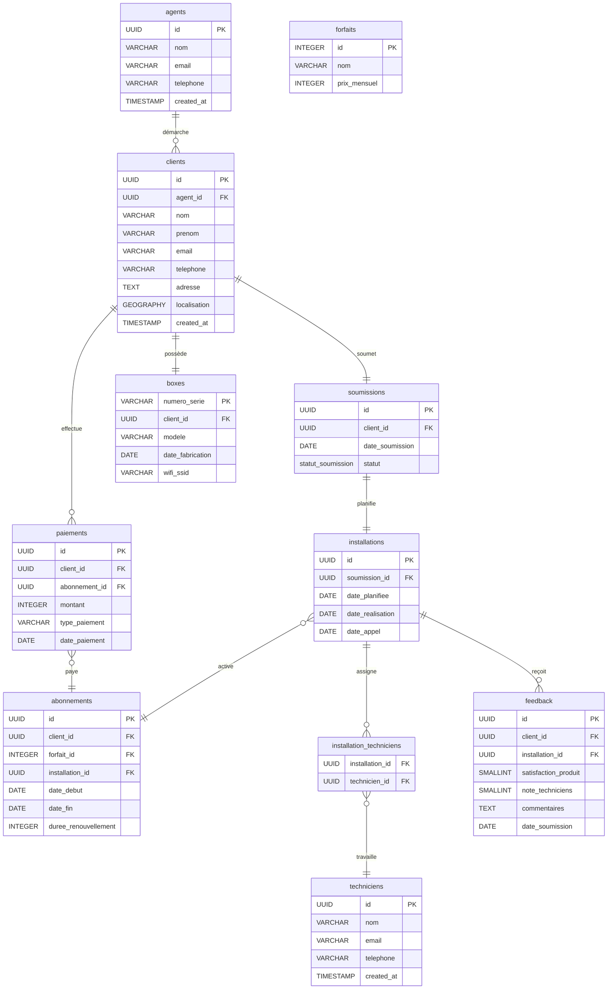

# **Projet Canalbox - Modélisation Data Warehouse**


## **Table des matières**
- [Contexte du projet](#contexte-du-projet)
- [Schéma de la base de données](#schéma-de-la-base-de-données)
- [Spécifications techniques](#spécifications-techniques)
- [Structure du projet](#structure-du-projet)
- [Projet dbt](#projet-dbt)
- [Tables et leur signification](#tables-et-leur-signification)
- [Structuration des données](#structuration-des-données)
- [Installation et configuration](#installation-et-configuration)
- [Documentation](#documentation)
- [Bonnes pratiques](#bonnes-pratiques)

## **Contexte du projet**

### **Présentation de Canalbox**
Canalbox est une entreprise de télécommunications opérant au Bénin, spécialisée dans la fourniture de services internet haut débit via des box fibre optique. Fondée en 2020, l'entreprise a connu une croissance rapide avec plus de 20 000 clients à ce jour, principalement à Cotonou et Porto-Novo.

### **Problématique**
Face à cette croissance, l'équipe a besoin d'un système de reporting et d'analyse robuste pour :
- Comprendre les tendances de croissance
- Identifier les causes de churn (désabonnement)
- Optimiser les processus d'installation
- Mesurer la satisfaction client
- Analyser la performance des équipes

### **Objectifs du projet**
1. **Centraliser** les données opérationnelles dans un seul référentiel
2. **Standardiser** les définitions métiers (MRR, LTV, etc.)
3. **Documenter** le modèle de données
4. **Automatiser** les pipelines de transformation
5. **Faciliter** l'analyse décisionnelle

### **Besoins métier clés**
- Suivi mensuel du MRR (Monthly Recurring Revenue)
- Analyse de la satisfaction client post-installation
- Suivi des performances des techniciens
- Analyse des tendances de désabonnement (churn)
- Mesure de l'efficacité des campagnes de marketing

## **Schéma de la base de données**
### **Relations clés**

### **Modèle relationnel**

Le modèle de données suit une approche en étoile avec une table de faits centrale et des tables de dimensions. Voici l'architecture globale :

```
                  +----------------+
                  |   dim_clients  |
                  +-------+--------+
                          |
                          | 1
                          |
                          | N
+----------------+  +-----v------+  +----------------+
| dim_agents     |  | fact_subscriptions |  | dim_subscription_plans |
+----------------+  +-----------+--------+  +------------------------+
                          |
                          | N
                          | 1
                  +-------v--------+
                  |   fact_payments  |
                  +------------------+
```

### **Schéma physique**

#### **Tables de dimensions (dim)**
- `dim_agents` : Informations sur les commerciaux
- `dim_technicians` : Informations sur les techniciens
- `dim_clients` : Informations détaillées sur les clients
- `dim_boxes` : Équipements distribués
- `dim_subscription_plans` : Forfaits disponibles
- `dim_dates` : Table de dates pour les calculs temporels

#### **Tables de faits (fact)**
- `fact_submissions` : Demandes d'installation
- `fact_installations` : Processus d'installation
- `fact_subscriptions` : Abonnements clients
- `fact_payments` : Paiements reçus
- `fact_feedback` : Retours clients

### **Contraintes et relations**

| Table | Clé primaire | Clé étrangère | Table cible |
|-------|--------------|---------------|-------------|
| clients | id | agent_id | agents.id |
| soumissions | id | client_id | clients.id |
| installations | id | soumission_id | soumissions.id |
| boxes | numero_serie | client_id | clients.id |
| abonnements | id | client_id | clients.id |
| abonnements | id | installation_id | installations.id |
| paiements | id | client_id | clients.id |
| paiements | id | abonnement_id | abonnements.id |
| feedback | id | client_id | clients.id |
| feedback | id | installation_id | installations.id |

### **Indexes stratégiques**

- **Indexes sur les clés étrangères** : Pour optimiser les jointures
- **Indexes sur les dates** : Pour les requêtes temporelles
- **Indexes composés** : Pour les requêtes analytiques courantes
- **Indexes conditionnels** : Pour les requêtes sur les données actives

Exemple d'index conditionnel :
```sql
CREATE INDEX idx_abonnements_actifs ON abonnements(date_debut, date_fin) 
WHERE date_debut <= CURRENT_DATE AND date_fin >= CURRENT_DATE;
```

## **Spécifications techniques**

### **Stack technique**
- **Base de données** : PostgreSQL 14+
- **Outil ETL** : dbt (data build tool) 1.9+
- **Génération de données** : Python 3.9+ avec Faker
- **Visualisation** : Metabase/Power BI
- **Versioning** : Git

### **Choix architecturaux**

#### **Modélisation en 3 couches (RAW, STAGING, MARTS)**
- **RAW** : Copie fidèle des sources opérationnelles
- **STAGING** : Standardisation et nettoyage
- **MARTS** : Modèles métier prêts pour l'analyse

#### **Modélisation dimensionnelle**
- Approche en étoile pour optimiser les requêtes analytiques
- Séparation claire entre faits (transactions) et dimensions (contexte)
- Utilisation de la table `dim_dates` pour les calculs temporels

#### **Gestion des données historiques**
- Conservation des historiques complets
- Gestion des Slowly Changing Dimensions (SCD) de Type 1
- Audit des transformations via dbt

### **Critères de qualité des données**

#### **Tests de schéma**
- Unicité des clés primaires
- Contraintes de non-nullité
- Relations référentielles
- Valeurs acceptées pour les ENUM

#### **Tests de données**
- Cohérence des plages de dates
- Validité des montants de paiement
- Taux de succès des installations
- Cohérence des périodes d'abonnement

### **Politique de gestion des données**

#### **Conservation des données**
- Données opérationnelles : 7 ans
- Données historiques : Indéfiniment
- Backups : Quotidiens avec rétention de 30 jours

#### **Sécurité**
- RBAC (Role-Based Access Control)
- Chiffrement des données sensibles
- Audit des accès

## **Structure du projet**

```
canalbox-project/
├── db/
│   ├── init.sql
│   ├── seeds/
│   │   └── geographic_zones.csv
│   └── data/
│       └── sample_data.sql
├── docs/
│   ├── architecture.md
│   ├── glossary.md
│   └── data_dictionary.xlsx
├── generate.py
├── config/
│   ├── settings.py
│   └── constants.py
├── models/
│   ├── agents/
│   │   └── ...
│   ├── clients/
│   │   └── ...
│   └── ...
├── canalbox-dbt/
│   ├── analyses/
│   ├── macros/
│   ├── models/
│   │   ├── raw/
│   │   ├── staging/
│   │   │   ├── dim/
│   │   │   └── fact/
│   │   └── marts/
│   │       ├── finance/
│   │       ├── marketing/
│   │       ├── operations/
│   │       └── customer/
│   ├── seeds/
│   ├── snapshots/
│   ├── tests/
│   ├── dbt_project.yml
│   └── profiles.yml
├── requirements.txt
├── .gitignore
└── README.md
```

### **Dossiers principaux**

- **`db/`** : Scripts d'initialisation de la base de données
- **`docs/`** : Documentation technique et métier
- **`generate.py`** : Script de génération de données synthétiques
- **`config/`** : Configuration et constantes
- **`canalbox-dbt/`** : Projet dbt complet
- **`requirements.txt`** : Dépendances Python

### **Conventions de nommage**

- **Tables sources** : Noms au pluriel en français (clients, installations)
- **Modèles dbt** : 
  - RAW : `raw_<table_source>`
  - STAGING : `dim_<nom>` ou `fact_<nom>`
  - MARTS : `fact_<domaine>_<nom>`
- **Colonnes** : snake_case avec préfixes sémantiques
  - `client_id`, `agent_name`, `payment_amount`

## **Projet dbt**

### **Présentation de dbt**

dbt (data build tool) est un outil open source pour la transformation de données. Il permet de :
- Structurer les transformations en modèles SQL
- Gérer les dépendances entre modèles
- Tester la qualité des données
- Documenter automatiquement le modèle de données

### **Architecture en 3 layers**

#### **1. Couche RAW**
- **Objectif** : Isoler les sources opérationnelles
- **Contenu** : Vues simples des tables sources
- **Caractéristiques** :
  - Aucune transformation
  - Documentation des sources
  - Tests basiques de qualité

#### **2. Couche STAGING (SILVER)**
- **Objectif** : Standardiser et nettoyer les données
- **Contenu** : 
  - Dimensions (dim) : Entités statiques ou à changement lent
  - Faits (fact) : Événements transactionnels
- **Caractéristiques** :
  - Renommage des colonnes
  - Ajout de métadonnées temporelles
  - Validation des données
  - Documentation détaillée

#### **3. Couche MARTS (GOLD)**
- **Objectif** : Fournir des modèles métier prêts pour l'analyse
- **Contenu** : Organisé par domaine métier
  - Finance
  - Marketing
  - Opérations
  - Expérience client
- **Caractéristiques** :
  - Indicateurs KPI métier
  - Agrégations pré-calculées
  - Modèles optimisés pour la performance

### **Modèles principaux**

#### **Finance**
- `fact_monthly_revenue` : Calcul du MRR et autres indicateurs financiers
- `fact_customer_ltv` : Valeur à vie des clients (LTV)
- `fact_payment_success_rate` : Taux de réussite des paiements

#### **Marketing**
- `fact_customer_acquisition` : Analyse de l'acquisition client
- `fact_customer_lifecycle` : Cycle de vie client complet

#### **Opérations**
- `fact_installation_efficiency` : Efficacité des installations
- `fact_technician_performance` : Performance des techniciens

#### **Expérience client**
- `fact_customer_satisfaction` : Satisfaction client post-installation
- `fact_churn_analysis` : Analyse des désabonnements

### **Dépendances entre modèles**

```
raw_agents
└── dim_agents
    ├── fact_customer_acquisition
    └── fact_customer_lifecycle

raw_clients
├── dim_clients
│   ├── fact_customer_acquisition
│   ├── fact_customer_lifecycle
│   ├── fact_customer_satisfaction
│   └── fact_churn_analysis
└── fact_subscriptions
    ├── fact_monthly_revenue
    ├── fact_customer_ltv
    └── fact_churn_analysis

raw_installations
└── fact_installations
    ├── fact_installation_efficiency
    └── fact_technician_performance

raw_payments
└── fact_payments
    ├── fact_monthly_revenue
    ├── fact_customer_ltv
    └── fact_payment_success_rate

raw_feedback
└── fact_feedback
    └── fact_customer_satisfaction
```

## **Tables et leur signification**

### **Tables de base de données**

#### **1. agents**
- **Description** : Commerciaux/démarcheurs
- **Colonnes clés** :
  - `id` : Identifiant unique
  - `nom` : Nom complet
  - `email` : Email professionnel
  - `telephone` : Numéro de téléphone
  - `created_at` : Date d'embauche
- **Statistiques typiques** :
  - 100-150 agents actifs
  - Taux de rotation : 15% par an
  - 30-50 nouveaux clients par agent/mois

#### **2. techniciens**
- **Description** : Techniciens d'installation
- **Colonnes clés** :
  - `id` : Identifiant unique
  - `nom` : Nom complet
  - `email` : Email professionnel
  - `telephone` : Numéro de téléphone
  - `created_at` : Date d'embauche
- **Statistiques typiques** :
  - 80-120 techniciens actifs
  - Taux d'installation à temps : 95%
  - 2-3 installations par technicien/jour

#### **3. clients**
- **Description** : Clients de Canalbox
- **Colonnes clés** :
  - `id` : Identifiant unique
  - `agent_id` : Commercial associé
  - `box_id` : Box attribuée
  - `nom`, `prenom` : Informations personnelles
  - `latitude`, `longitude` : Coordonnées GPS
  - `created_at` : Date d'acquisition
- **Statistiques typiques** :
  - 20 000+ clients
  - Taux de désabonnement (churn) : 5-8% par mois
  - 70% des clients à Cotonou

#### **4. soumissions**
- **Description** : Demandes d'installation
- **Colonnes clés** :
  - `id` : Identifiant unique
  - `client_id` : Client associé
  - `date_soumission` : Date de demande
  - `statut` : Statut (soumis, planifié, complété)
- **Statistiques typiques** :
  - 25 000+ soumissions
  - Période de pointe : 25 du mois au 8 du mois suivant
  - Délai moyen avant installation : 3-5 jours

#### **5. installations**
- **Description** : Processus d'installation
- **Colonnes clés** :
  - `id` : Identifiant unique
  - `soumission_id` : Soumission associée
  - `date_planifiee` : Date planifiée
  - `date_realisation` : Date réelle
  - `date_appel` : Date d'appel client
- **Statistiques typiques** :
  - 95% des installations réussies
  - 95% à temps (délai moyen : 0.5 jour)
  - 2 techniciens par installation

#### **6. boxes**
- **Description** : Équipements distribués
- **Colonnes clés** :
  - `numero_serie` : Numéro de série unique
  - `client_id` : Client propriétaire
  - `modele` : Modèle de la box
  - `date_fabrication` : Date de fabrication
  - `wifi_ssid` : Nom du réseau WiFi
- **Statistiques typiques** :
  - 3 modèles principaux (HG8245H, F609, G-240W-A)
  - Durée de vie moyenne : 3-5 ans
  - 1 box par client

#### **7. abonnements**
- **Description** : Abonnements clients
- **Colonnes clés** :
  - `id` : Identifiant unique
  - `client_id` : Client associé
  - `forfait_id` : Forfait choisi
  - `installation_id` : Installation associée
  - `date_debut`, `date_fin` : Période d'abonnement
  - `duree_renouvellement` : Durée en mois
- **Statistiques typiques** :
  - 2 forfaits principaux (50 Mbps à 15k, 200 Mbps à 30k)
  - 80% des clients souscrivent au forfait de base
  - Durée moyenne d'abonnement : 6-8 mois

#### **8. paiements**
- **Description** : Paiements des clients
- **Colonnes clés** :
  - `id` : Identifiant unique
  - `client_id` : Client associé
  - `abonnement_id` : Abonnement associé
  - `montant` : Montant en XOF
  - `type_paiement` : Type (initial, renouvellement)
  - `date_paiement` : Date de paiement
- **Statistiques typiques** :
  - Taux de réussite des paiements : 95%
  - 90% des paiements par mobile money
  - 25 000+ transactions/mois

#### **9. feedback**
- **Description** : Retours clients après installation
- **Colonnes clés** :
  - `id` : Identifiant unique
  - `client_id` : Client associé
  - `installation_id` : Installation associée
  - `satisfaction_produit` : Note produit (1-5)
  - `note_techniciens` : Note techniciens (1-5)
  - `commentaires` : Commentaires libres
  - `date_soumission` : Date de soumission
- **Statistiques typiques** :
  - 80% des clients donnent un feedback
  - Note moyenne produit : 4.2/5
  - Note moyenne techniciens : 4.5/5

### **Tables de modélisation dbt**

#### **Dimensions**
- **dim_agents** : Agents avec métadonnées temporelles
- **dim_technicians** : Techniciens avec ancienneté
- **dim_clients** : Clients avec segmentation géographique
- **dim_boxes** : Boxes avec classification par gamme
- **dim_subscription_plans** : Forfaits avec caractéristiques
- **dim_dates** : Table de dates pour les calculs

#### **Faits**
- **fact_submissions** : Demandes d'installation avec contexte
- **fact_installations** : Processus d'installation complet
- **fact_subscriptions** : Abonnements avec valeurs calculées
- **fact_payments** : Transactions avec classification
- **fact_feedback** : Retours clients avec catégories

#### **Marts (modèles métier)**
- **finance/fact_monthly_revenue** : MRR et indicateurs financiers
- **marketing/fact_customer_acquisition** : Acquisition client
- **operations/fact_installation_efficiency** : Efficacité opérationnelle
- **customer/fact_customer_satisfaction** : Satisfaction client

## **Structuration des données**

### **Flux de données**

```
Données opérationnelles
        ↓
    Couche RAW (dbt)
        ↓
Couche STAGING (dbt)
        ↓
   Couche MARTS (dbt)
        ↓
    Rapports & Dashboards
```

### **Processus ETL**

1. **Extraction** :
   - Données provenant des systèmes opérationnels
   - Chargement dans la base de données principale

2. **Transformation** :
   - Couche RAW : Copie fidèle des sources
   - Couche STAGING : Standardisation et nettoyage
   - Couche MARTS : Agrégation et calculs métier

3. **Chargement** :
   - Modèles matérialisés en tables
   - Documentation générée automatiquement
   - Tests exécutés à chaque build

### **Gestion des mises à jour**

#### **Données incrémentales**
- **Stratégie** : Insertion de nouvelles données
- **Fréquence** : Toutes les 24h
- **Logique** : Comparaison par date de création

#### **Données historiques**
- **Stratégie** : Conservation complète
- **Audit** : Suivi des modifications via dbt
- **Purge** : Aucune purge prévue

### **Stratégies de partitionnement**

#### **Partitionnement temporel**
- **Tables clés** : fact_payments, fact_subscriptions
- **Granularité** : Mensuelle
- **Avantages** :
  - Performances améliorées pour les requêtes récentes
  - Gestion efficace des données historiques

#### **Partitionnement par zone géographique**
- **Tables clés** : dim_clients, fact_installations
- **Zones** : Cotonou, Porto-Novo, Ouidah, Autre
- **Avantages** :
  - Analyse régionale optimisée
  - Rapports par zone plus rapides

## **Installation et configuration**

### **Prérequis**
- PostgreSQL 14+
- Python 3.9+
- dbt 1.9+
- Git

### **Étapes d'installation**

1. **Initialiser la base de données** :
```bash
psql -U postgres -c "CREATE DATABASE canalbox;"
psql -U postgres -d canalbox -f db/init.sql
```

2. **Générer des données de test** :
```bash
python generate.py --agents 150 --techniciens 120 --clients 25000
```

3. **Configurer dbt** :
```bash
cd canalbox-dbt
cp profiles.yml.example profiles.yml
# Modifier profiles.yml avec vos paramètres
```

4. **Installer les dépendances** :
```bash
dbt deps
```

5. **Exécuter les transformations** :
```bash
dbt run --full-refresh
```

### **Configuration de la base de données**

Dans `profiles.yml` :
```yaml
canalbox:
  target: dev
  outputs:
    dev:
      type: postgres
      host: localhost
      user: your_username
      password: your_password
      port: 5432
      dbname: canalbox
      schema: dbt_canalbox
      threads: 4
```

## **Documentation**

### **Génération de la documentation**

```bash
dbt docs generate
dbt docs serve
```

### **Contenu de la documentation**

1. **Modèle de données** :
   - Schéma relationnel interactif
   - Dépendances entre modèles
   - Documentation des colonnes

2. **Tests de données** :
   - Statut des tests
   - Historique des exécutions
   - Rapports de qualité

3. **Métriques clés** :
   - Définitions des KPI
   - Calculs détaillés
   - Sources de données

### **Bonnes pratiques de documentation**

- **Documentation des colonnes** : Description claire et concise
- **Exemples de requêtes** : Pour chaque modèle métier
- **Glossaire métier** : Définition des termes clés
- **Cas d'utilisation** : Scénarios d'analyse concrets

## **Bonnes pratiques**

### **Gestion de code**

- **Versioning** : Utiliser Git avec branches feature
- **PRs** : Revue de code pour les transformations
- **Tests** : 100% de couverture des tests critiques
- **Documentation** : Mettre à jour la documentation à chaque modification

### **Qualité des données**

- **Tests unitaires** : Pour chaque colonne critique
- **Tests de seuil** : Alertes pour les valeurs anormales
- **Monitoring** : Suivi des métriques de qualité
- **Correction proactive** : Processus de correction rapide

### **Performance**

- **Indexation** : Indexer les colonnes fréquemment utilisées
- **Partitionnement** : Partitionner par période
- **Matérialisation** : Tables pour les modèles fréquemment utilisés
- **Optimisation** : Analyser les requêtes lentes

### **Governance**

- **Propriétaires** : Désigner un propriétaire par domaine
- **SLAs** : Définir des délais de traitement
- **Audit** : Journaliser les modifications
- **Sécurité** : Gérer les accès par rôle

